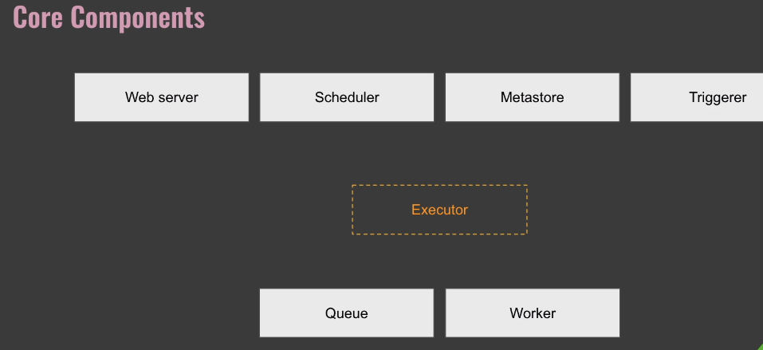
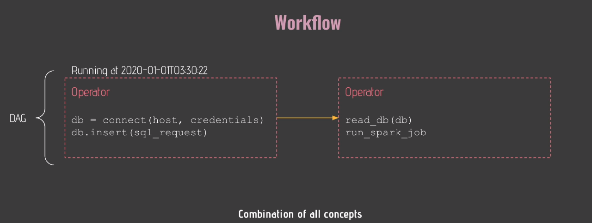
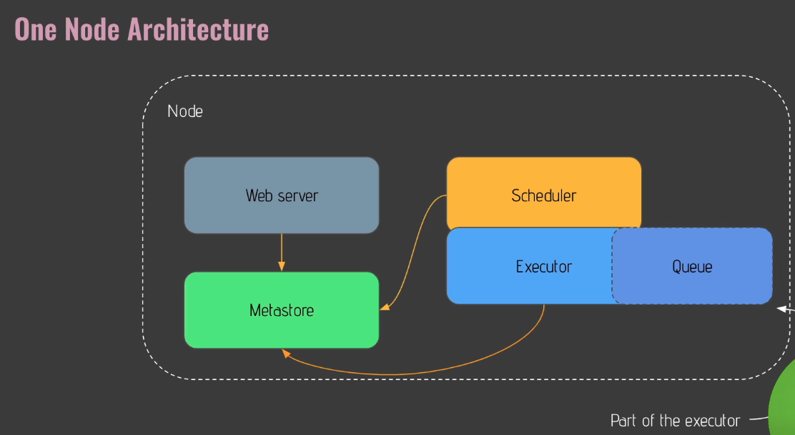
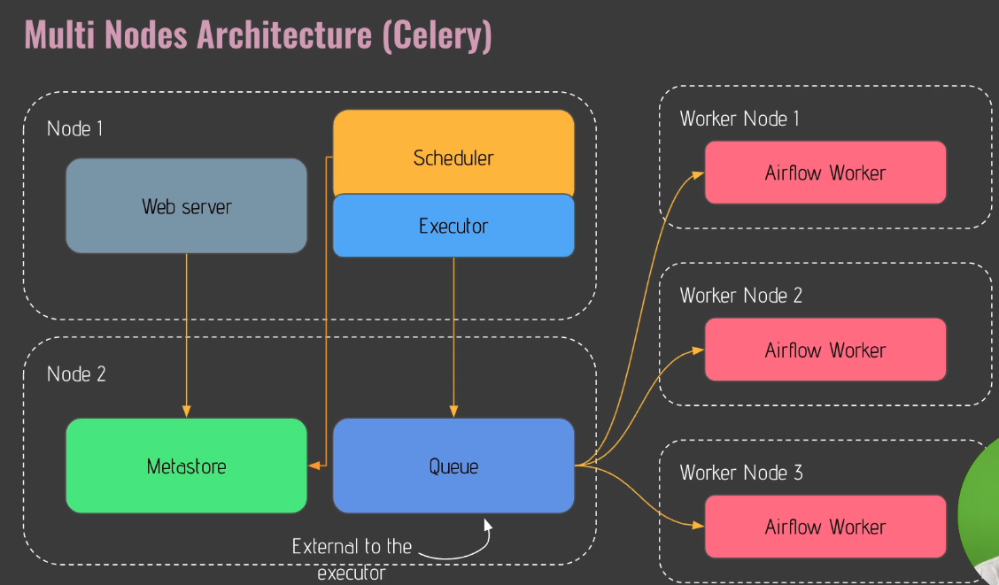
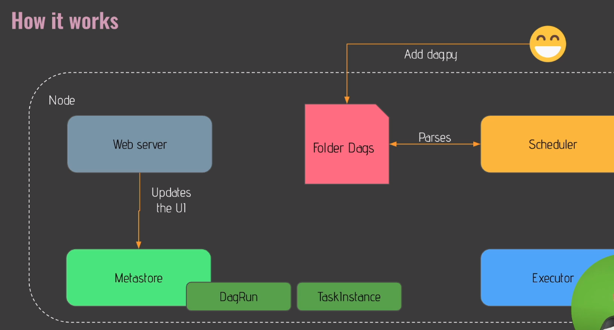
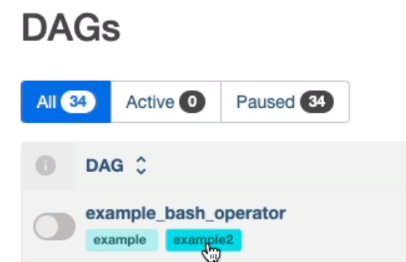
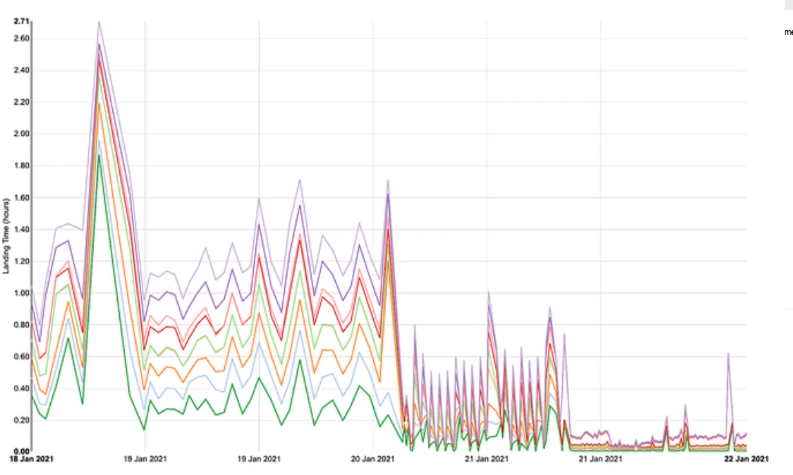
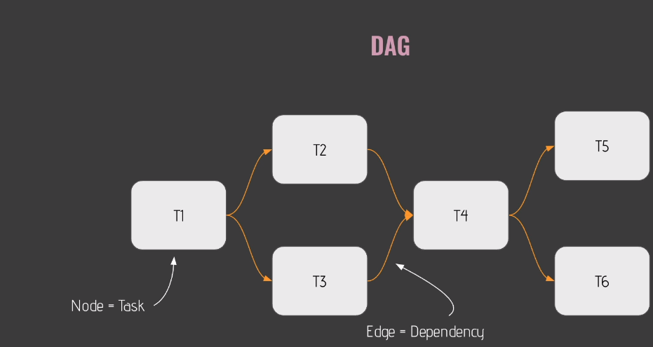

# My-AirFlow-Notes
Listing my airflow notes on this repo.

This repository containes the notes that I took from [this course](https://www.udemy.com/course/the-complete-hands-on-course-to-master-apache-airflow/)

## Getting Started With Airflow

1) Let's imagine we ha ve data pipeline running on 10:00 a.m each day. It is Extracting data via an API, Loading it into Snowflake and Transforming it via [dbt](https://www.getdbt.com/). Airflow is a tool that manages all of these stages. We can mange failures in data pipelines automatically.

2) Think Airflow as cook, data pipelines as recipe, the tasks as ingredients.

3) Airflow is to

- author workflows
- schedule workflows
- monitor workflows.

4) Some benefits of Airflow

- Dynamic: It is on Python, not on a static file like a xml file.
- Scalability: We can have many data pipelines.
- UI: It has a UI. Cron doesn't have a UI.
- Extensiblity: Many plug-ins available and we can customize new plug-ins too.

5) Core components of Airflow

- Web Server: A flask web server that allows us to use UI.
- Scheduler: It is in charge of scheduling our tasks.
- Metastore: A database compatible with SQL Alchemy(Postgresql, mysql, oracle). We have data related to our data pipelines in metastore.
- Triggerer: Allows us to run specific types of tasks.

6) Executor defines how and on which support our tasks executed. For example, KubernetesExecutor is used to run tasks on Kubernetes Cluster. If we want to run our tasks on Celery Cluster, CeleryExecutor comes in handy. CeleryExecutor has 2 additional core components called Queue and Worker. Queue is responsible for executing in the right order. Workers are where our tasks are effectively executed. There is a Queue component in each Executor. In KubernetesExecetor, there is no Worker component. An Executor defines how our tasks are executed, whereas a worker is a process executing our task.

7) DAG means Directed Acyclic Graph and it is nothing more than a graph. Acylic means task create no cycle.

8) Operator is nothing more than a task. 3 differnt types of Operator:

- Action Operators: It executes something. For example, PythonOperator executes Python functions and BashOperator executes Bash commands.

- Transfer Operators: It transfer data from point A to point B.

- Sensor Operators: They allow you to wait for something to happen before moving to the next task.

9) Airflow is NOT a data streaming solution. Airflow is NOT a data processing framework. You should use Airflow to trigger the tool that will process my data. There is a spark jub submit operator triggered by Airflow. It processes data.

10) There are 2 common architectures common in Airflow:

- Single Node Architecture: Easiest way to deploy Airflow. In the below photo, Executor is a part of Scheduler.

- Multi Node Architecture: Can be applied via k8s or Celery. The below image is implemented via Celery. Executor isn't a part of Scheduler.

11) If we add a new DAG named dag01.py to our DAG's folder, The scheduler reloads the new dags in every five minutes. We may wait for 5 minutes to see our DAG in UI. If we modified an existing DAG, we may have to wait for 30 seconds.

12) The steps of a running DAG

- Developer adding the task in DAG's folder
- The scheduler parses the code and make it visible on UI.
- The scheduler runs the DAG and it creates a **DAG run object** for that DAG with a state **running**.
- DAG run takes the first task to execute. **First task** becomes **task instance object**. The **task instance object** has the state **None** and it is scheduled.
- The scheduler sends the task instance object to the queue of Executor. Now, the state of the task becomes **queued**.
- The executor creates a sub process to run the task and the **task instance object** has the state **running**.
- When the task is done, it has a state of **fail** or **success**.
- Then, the scheduler checks whethere there is any task to execute.
- If there is no task remaining to be executed, the DAG is done and **DAG run object** has the state of success.

13) Download docker-compose.yaml file from [here](https://airflow.apache.org/docs/apache-airflow/2.3.0/docker-compose.yaml). The reason why redis service exists in yaml file is that celery executor uses it.

14) How to pause and unpause a DAG and assign tags to a DAG. You are not able to define permissions according to tasks.

15) Delete DAG button doesn't delete DAG and its affiliated file. It just deletes metadata relating to DAG object.

16) Grid View on UI provides us with summary statistics of DAG.

17) Graph View on UI provides us with visualizations of tasks.

18) Landing Times on UI provides us with historical timinings of each task in the DAG.

19) Calendar on UI provides us with historical status of each runs.

20) Gantt on UI enables us to detect any bottleneck on our tasks.

21) Code on UI enables us to see the code of our DAGs.

22) Tasks and dependencies on a DAG

