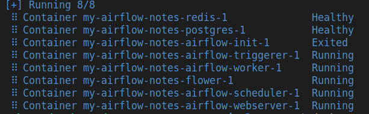
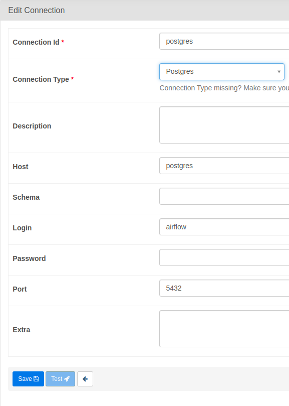
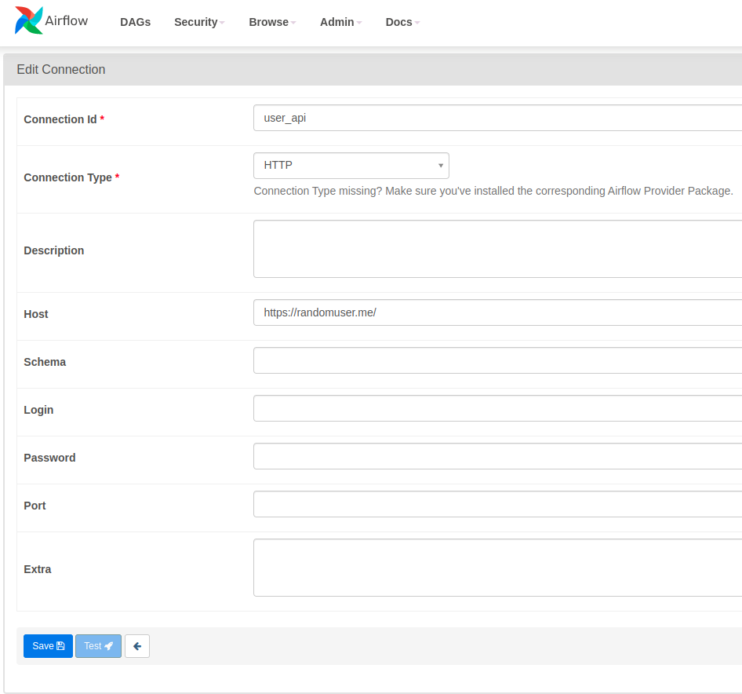
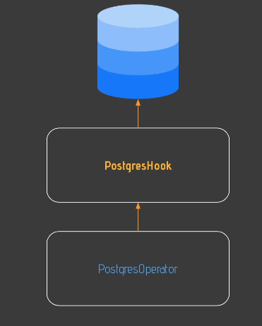
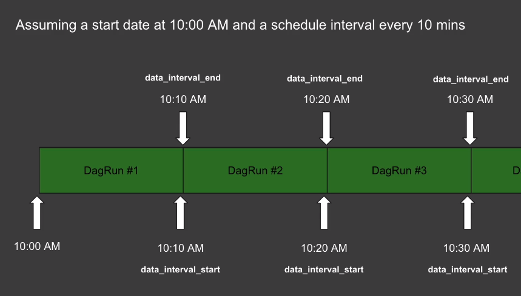
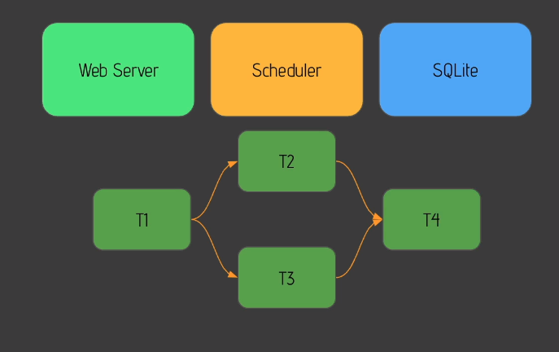
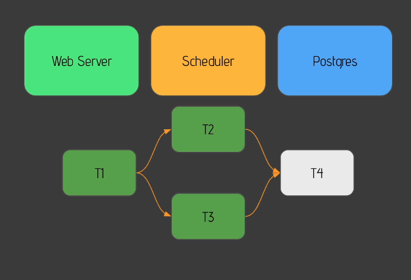
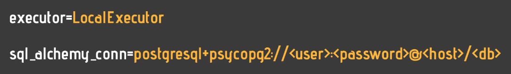
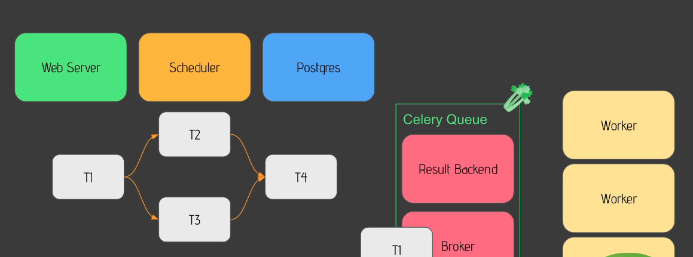
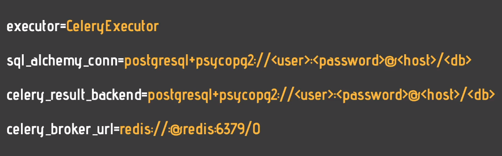

# My-AirFlow-Notes
Listing my airflow notes on this repo.

This repository containes the notes that I took from [this course](https://www.udemy.com/course/the-complete-hands-on-course-to-master-apache-airflow/)

## Getting Started With Airflow

1) Let's imagine we ha ve data pipeline running on 10:00 a.m each day. It is Extracting data via an API, Loading it into Snowflake and Transforming it via [dbt](https://www.getdbt.com/). Airflow is a tool that manages all of these stages. We can mange failures in data pipelines automatically.

2) Think Airflow as cook, data pipelines as recipe, the tasks as ingredients.

3) Airflow is to

- author workflows
- schedule workflows
- monitor workflows.

4) Some benefits of Airflow

- Dynamic: It is on Python, not on a static file like a xml file.
- Scalability: We can have many data pipelines.
- UI: It has a UI. Cron doesn't have a UI.
- Extensiblity: Many plug-ins available and we can customize new plug-ins too.

5) Core components of Airflow

- Web Server: A flask web server that allows us to use UI.
- Scheduler: It is in charge of scheduling our tasks.
- Metastore: A database compatible with SQL Alchemy(Postgresql, mysql, oracle). We have data related to our data pipelines in metastore.
- Triggerer: Allows us to run specific types of tasks.


6) Executor defines how and on which support our tasks executed. For example, KubernetesExecutor is used to run tasks on Kubernetes Cluster. If we want to run our tasks on Celery Cluster, CeleryExecutor comes in handy. CeleryExecutor has 2 additional core components called Queue and Worker. Queue is responsible for executing in the right order. Workers are where our tasks are effectively executed. There is a Queue component in each Executor. In KubernetesExecetor, there is no Worker component. An Executor defines how our tasks are executed, whereas a worker is a process executing our task.

7) DAG means Directed Acyclic Graph and it is nothing more than a graph. Acylic means task create no cycle.

8) Operator is nothing more than a task. 3 differnt types of Operator:

- Action Operators: It executes something. For example, PythonOperator executes Python functions and BashOperator executes Bash commands.

- Transfer Operators: It transfer data from point A to point B.

- Sensor Operators: They allow you to wait for something to happen before moving to the next task.


9) Airflow is NOT a data streaming solution. Airflow is NOT a data processing framework. You should use Airflow to trigger the tool that will process my data. There is a spark jub submit operator triggered by Airflow. It processes data.

10) There are 2 common architectures common in Airflow:

- Single Node Architecture: Easiest way to deploy Airflow. In the below photo, Executor is a part of Scheduler.


- Multi Node Architecture: Can be applied via k8s or Celery. The below image is implemented via Celery. Executor isn't a part of Scheduler.


11) If we add a new DAG named dag01.py to our DAG's folder, The scheduler reloads the new dags in every five minutes. We may wait for 5 minutes to see our DAG in UI. If we modified an existing DAG, we may have to wait for 30 seconds.

12) The steps of a running DAG

- Developer adding the task in DAG's folder
- The scheduler parses the code and make it visible on UI.
- The scheduler runs the DAG and it creates a **DAG run object** for that DAG with a state **running**.
- DAG run takes the first task to execute. **First task** becomes **task instance object**. The **task instance object** has the state **None** and it is scheduled.
- The scheduler sends the task instance object to the queue of Executor. Now, the state of the task becomes **queued**.
- The executor creates a sub process to run the task and the **task instance object** has the state **running**.
- When the task is done, it has a state of **fail** or **success**.
- Then, the scheduler checks whethere there is any task to execute.
- If there is no task remaining to be executed, the DAG is done and **DAG run object** has the state of success.


13) Download docker-compose.yaml file from [here](https://airflow.apache.org/docs/apache-airflow/2.3.0/docker-compose.yaml). The reason why redis service exists in yaml file is that celery executor uses it. After placing the content in a **docker-compose.yaml**, run `docker-compose up -d`. There are 8 services on docker-compose yaml file:



14) How to pause and unpause a DAG and assign tags to a DAG. You are not able to define permissions according to tasks.


15) Delete DAG button doesn't delete DAG and its affiliated file. It just deletes metadata relating to DAG object.

16) Grid View on UI provides us with summary statistics of DAG.

17) Graph View on UI provides us with visualizations of tasks.

18) Landing Times on UI provides us with historical timinings of each task in the DAG.


19) Calendar on UI provides us with historical status of each runs.

20) Gantt on UI enables us to detect any bottleneck on our tasks.

21) Code on UI enables us to see the code of our DAGs.

22) Tasks and dependencies on a DAG


23) dags/user_processing.py is the first DAG we defined. It is a bind mounted to a docker container and we can see it on UI as a DAG.

24) In a DAG, there are numerous tasks and these tasks are defined as operators. An operator is a single task in our DAG. The taskid parameter of any operator or sensor can be the name of that sensor or operator.

25) Let's imagine a DAG that has two missions: cleaning data and processing data. Don't put them in a single task(operator). We should create 2 different tasks(operator).

26) Airflow is built in modular way. To install core library, run `pip install apache-airflow`. The core library has PythonOperator and BashOperator by default. However, this might not be sufficient. Thus, we should install some providers like **apache-airflow-providers-amazon**, **apache-airflow-providers-snowflake** & **apache-airflow-providers-databricks** etc. These providers show us that Airflow is so extensible.

27) After creating the first task named **create_table** in user_processing.py, define the connection named **postgres** on Airflow UI. Another connection used in is_api_available task is also below.





28) After ading a new task to DAG, it is advised to test it. To test it, enter the scheduler(my-airflow-notes-airflow-scheduler-1) via `docker exec -it my-airflow-notes-airflow-scheduler-1 bash` and run the following:

```temp.sh
airflow tasks test user_processing create_table 2022-01-01
```

29) Sensors in Airflow is like a person waiting for a bus. Sensors wait for something to happen before executing the next task. Some sensors example are landing a file(**FileSensor**) or entries in a SQL table or an entry in an S3 bucket, you can use the **S3KeySensor**. There are 2 parametes belonging to a Sensor:

- poke_interval: 60 seconds by default. The sensor checks if the condition is true or not before executing the next task.

- timeout: 7 days by default.

30) **HttpSensor** is an example sensor. It is imported via `from airflow.providers.http.sensors.http import HttpSensor`. It check whether a url is active or not.

31) SimpleHttpOperator is used in extracting data from API.

32) PythonOperator is allowing us to execute a Python function. In user_processing DAG, define a function named **_process_user** and call it from the task called process_user(an instance of PythonOperator).

33) In Airflow, we can interact with many tools. To make sure that is easy to interact with a tool, there is a concept called Hook. Hook is allowing us to interact with an external tool or external service easily.  For instance, when we make an operation of insert via PostgresOperator, PostgresHook is called behind the scenes. The goal of PostgresHook is to abstract all the complexity of interacting with a database. Other Hook examples: AwsHOok, MySqlHook etc. Sometimes, we can't access to some necessary methods via operators. In these kinds of situations, take a look at Hooks.



34) It is recommended to define dependencies at the end of DAG file.

35) Some important parameters for DAG Scheduling:

- start_date parameter of DAG defines times at which our DAGs being scheduled.

- schedule_interval: How often a DAG runs.

- end_date: The time till our DAG will run. It isn't obligatory but possible to define.

36) Every DAGrun object has 2 different attributes: 'data_interval_start' and 'data_interval_end'



37) Backfilling is catching up our non-triggered DAG Runs. `catchup=True` lets us backfill non-triggered DAG's.

38) Executor in Airflow:

- doesn't run tasks
- doesn't execute tasks.
- defines how to run tasks, on which system etc.

39) 2 types of Executor:

- Local: Local Executor(To run multiple tasks on a single machine) and Sequential Executor(to run a single task on a single machine)

- Remote: CeleryExecutor(To run tasks on Celery cluster), KubernetesExecutor(To run tasks on k8s cluster)

40) To configure which executor to be called, configure it configuration file. The default executor in airflow.cfg is __SequentialExecutor__.

41) In order to obtain default Airflow configurations, copy the configuration from docker container to host machine.

```temp.sh
# the docker-compose.yaml files located in My-AirFlow-Notes
docker cp my-airflow-notes-airflow-scheduler-1:/opt/airflow/airflow.cfg .

```

42) There are 6 important configuration titles in **airflow.cfg**.

43) The line having **AIRFLOW__CORE__EXECUTOR** in docker-compose.yaml overrides the line defining Executor in the configuration file. When we using docker, we are configuring it via docker-compose.yaml, not via airflow.cfg in the container.

44) **SequentialExecutor** is the default executor when you install it manually. It runs one task at a time. In the following picture, the order is T1 -> T2 -> T3 -> T4. It is used in making experiments or debugging some issues. **SequentialExecutor** is used in SQLite databases.



45) The **LocalExecutor** is one step further than **SequentialExecutor**. As it allows us to run **multiple** tasks **at the same time** on a **single** machine. It is used with PostgreSQL, Oracle, MySQL databases(no SQLite databases). **LocalExecutor** doesn't scale very well because it runs on a single machine. T1 runs first. T2 & T3 runs at the same time. T4 runs last.



46) To use **LocalExecutor**, change the followings on docker-compose.yaml.



47) CeleryExecutor runs our tasks on multiple machines on a celery cluster. To be able to use CeleryExecutor, we shuld install celery queue. Possible celery queues are redis and rabbitmq. Override them via defining in docker-compose.yaml.






